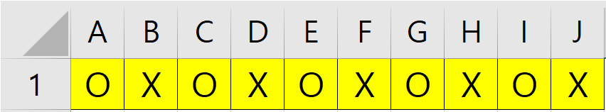
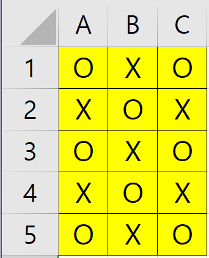

# 자바 소스 코드

1. 클래스 알아보기
+ 생성자 : `class`를 객체로 생성하여 만들기 위한 대상
+ 변수 : 해당 자료형의 값을 담기 위하여 만들고 사용하는 대상
+ 상수 : 변수와 동일하지만 `한번 값을 넣고 수정을 할 수 없다는 특징`을 가지고 있습니다.
+ 메소드 : `기능`을 정의 하여 필요한 로직을 구현하는 대상
* `java` 파일를 컴파일 하기
```
javac Study.java
```
* `class` 파일를 실행 하기
```
java Study
```

2. 주석 (설명문 넣기)
```
1. 한줄 주석 : //
2. 범위 주석 : /* */
```

3. 연산자 알아보기
+ `+` 합을 구하는 연산자
+ `-` 빼기를 하는 연산자
+ `*` 곱을 하는 연산자
+ `/` 나누기를 하는 연산자
+ `%` 나머지를 구하는 연산자

4. 조건문 `if / else if / else`
+ if문
```java
if(조건식) {

}
```
+ else if문
```java
if(조건식) {

} else if(조건식) {

}
```
+ else문
```java
if(조건문) {

} else {

}
```
### 비교자 
+ `==` 앞의 값과 뒤에 값이 같은지 알아보는 비교자
+ `!=` 앞의 값과 뒤에 값이 같지 않은지 알아보는 비교자
> +  `!` << `not` 반전이라는 의미를 가지고 있습니다.
+ `>` 앞의 값이 뒤에 값 보다 큰지 알아보는 비교자
+ `<` 뒤의 값이 앞의 값 보다 큰지 알아보는 비교자
+ `>=` 앞의 값이 뒤에 값 보다 크거나 같은지 알아보는 비교자
+ `<=` 뒤의 값이 앞의 값 보다 큰거나 같은지 알아보는 비교자

5. switch/case문
```java
switch(입력변수) {
    case "": [명령 블럭]
    default : [명령 블럭]
}
```

6. for문
```java
for( ; ; ) {

}
```
---
## 1일차 문제
+ 아래의 연산의 결과 값은?
```java
int a = 10;
boolean b = false;
System.out.print( (a + b) );
```
+ 아래의 조건문에서 어떤 내용이 출력 될까요?
```java
String a = "자바";
String b = new String("자바");
if(a == b) {
    System.out.print("참");
} else {
    System.out.print("거짓");
}
```
+ 아래의 구구단에서 `짝수`의 단만 출력하려면 어떻게 해야할까요?
```
for(int 단 = 1; 단 <= 9; 단++) {
    System.out.println(단 + "단");
    for(int i = 1; i <= 9; i++) {
        System.out.print(단 + " * " + i + " = " + (단 * i) + "\t" );
    }
    System.out.println();
}
```
---
## 배열
+ 1차원 배열
```java
String[] 변수명 = new String[10];
```
> 1차원 배열에 값 넣기
```java
변수명[위치값] = "값";
```

+ 2차원 배열
```java
String[][] 변수명 = new String[5][5];
```
> 2차원 배열에 값 넣기
```java
변수명[행위치값][열위치값] = "값";
```
---
## 배열 문제
+ 1차원 배열로 아래의 그림과 같이 넣으시오. 단, 값을 넣을때 for문 사용

</img>

+ 2차원 배열로 아래의 그림과 같이 넣으시오. 단, 값을 넣을때 for문 사용

</img>
---

## 클래스 (Class)
+ 생성자
+ 객체 생성

## 컬렉션 (Collection)
+ List
> - 리스트는 배열과 비슷하다.
> - 리스트는 배열과 다르게 크기를 정하지 않는다.
> - 리스트는 서로 다른 자료형을 담을 수 있다.
1. 선언 및 생성
```java
List<?> list = new ArrayList<?>();
```
2. 리스트에 값 넣기
```java
list.add(?);
```
3. 리스트에서 선택적으로 값 가져오기
```java
list.get(인덱스);
```
4. 리스트의 크기(사이즈) 가져오기
```java
list.size();
```
5. 리스트에서 선택적으로 삭제하기
```java
list.remove("값");
list.remove(인덱스)
```

+ Map
> - 맵은 사전(Dictionary)과 비슷하다.
> - 맵은 키(key)와 값(value)을 한 쌍으로 사용하는 자료형이다.
> - 맵은 동일한 키(key)를 담을 수 있지만 가장 마지막 값을 가진다.
1. 선언 및 생성
```java
Map map = new HashMap();
```
2. 맵에 값 넣기
```java
map.put(key, value);
```
3. 맵에서 선택적으로 값 가져오기
```java
map.get(key);
```
4. 맵의 크기(사이즈) 가져오기
```java
map.size();
```
5. 맵에서 선택적으로 삭제하기
```java
map.remove(key);
```
